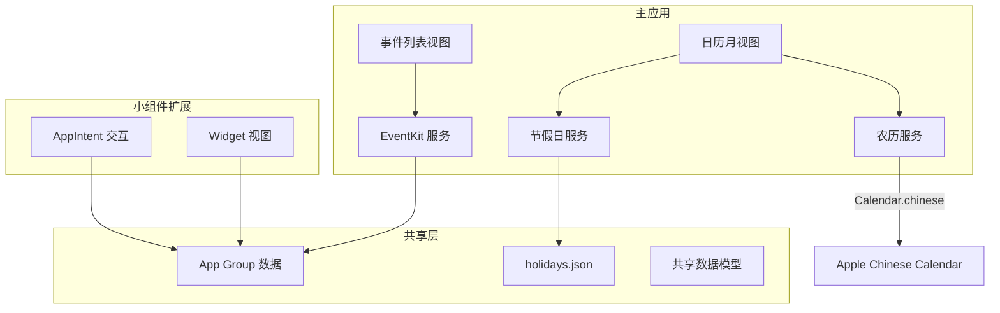

根据用户的确认选择，我现在来制定详细的开发计划。

<plan_result>
<req>

## 产品概述

一款 iOS 极简日历应用，融合公历与农历双历显示，标注中国法定节假日及调休信息，关联系统日历事件，并提供交互式桌面小组件。

## 核心功能

- **双历日历视图**：月视图展示公历日期，每个日期单元格同时显示农历日期，节假日名称以标签形式呈现
- **节假日与调休**：内置中国法定节假日 JSON 数据，标注放假及调休上班日，支持 2024-2027 年数据
- **系统日历事件**：通过 EventKit 读取系统日历事件，选中日期后展示当日所有事件列表
- **交互式小组件**：桌面小组件支持左右切换日期，点击日期显示对应事件详情，提供小/中两种尺寸
- **命令行打包**：提供 Shell 脚本，通过 xcodebuild 命令行打包生成 IPA 文件
</req>

<tech>

## 技术栈

- **语言**: Swift 6.0
- **UI 框架**: SwiftUI
- **最低版本**: iOS 18.0
- **农历算法**: Apple 原生 `Calendar(identifier: .chinese)` + DateFormatter 中文格式化
- **节假日数据**: 内置 JSON 文件，覆盖 2024-2027 年中国法定节假日及调休
- **系统日历**: EventKit 框架 (EKEventStore)
- **小组件**: WidgetKit + App Intent (iOS 18 交互式)
- **数据共享**: App Group (主 App 与 Widget 共享数据)
- **依赖管理**: Swift Package Manager
- **打包工具**: xcodebuild + Shell 脚本

## 实现方案

### 核心策略

采用纯 SwiftUI + 原生框架方案，最大化减少第三方依赖。农历转换使用 Apple 内置 Chinese Calendar，避免外部库版本维护负担；节假日数据通过 JSON 文件内置，确保离线可用；Widget 使用 iOS 18 AppIntent 实现交互式日期切换。

### 农历实现

- 使用 `Calendar(identifier: .chinese)` 进行公历-农历互转
- 通过 `DateFormatter` 配置 `calendar = chineseCalendar` 格式化农历字符串
- 大月/小月/闰月信息通过 `Calendar` 的 `range(of:in:for:)` 获取
- 传统节日（春节、中秋等）通过农历月日映射表计算
- 节气通过天文算法计算（简化版，精度满足日历显示需求）

### 节假日数据

- JSON 结构：`{ "2025": { "01-01": { "name": "元旦", "type": "holiday" }, "01-26": { "name": "调休上班", "type": "workday" } } }`
- 类型分为：holiday（放假）、workday（调休上班）
- App 启动时加载到内存，按年缓存

### EventKit 集成

- 请求 `EKEventStore` 访问权限
- 按日期范围查询事件，结果缓存至 App Group 共享容器供 Widget 读取
- 事件信息提取：标题、时间、日历颜色标识

### Widget 交互设计

- 使用 `AppIntent` 定义 `NextDayIntent` / `PreviousDayIntent` / `SelectDateIntent`
- Widget 通过 `AppEntry` 传递当前选中日期状态
- 点击日期通过 `Link` 或 `AppIntent` 跳转至主 App 对应日期
- 主 App 与 Widget 通过 App Group UserDefaults 同步选中日期

### 打包方案

- 使用 `xcodebuild archive` 生成 xcarchive
- 使用 `xcodebuild -exportArchive` 导出 IPA
- 支持 Development 和 Ad-Hoc 两种分发方式
- 脚本参数化：Bundle ID、Team ID、Profile 名称

## 架构设计



## 目录结构

```
og-calendar/
├── OGCalendar/                        # 主应用 Target
│   ├── App/
│   │   └── OGCalendarApp.swift        # [NEW] App 入口，配置导航、权限请求
│   ├── Models/
│   │   ├── Holiday.swift              # [NEW] 节假日模型，含名称、类型枚举
│   │   ├── CalendarDay.swift          # [NEW] 日期模型，封装公历/农历/节假日/事件
│   │   └── CalendarEvent.swift        # [NEW] 系统日历事件模型
│   ├── Services/
│   │   ├── LunarCalendarService.swift # [NEW] 农历转换服务，基于 Calendar.chinese
│   │   ├── HolidayService.swift       # [NEW] 节假日查询服务，加载 JSON 数据
│   │   ├── SolarTermService.swift     # [NEW] 24节气计算服务
│   │   └── EventKitService.swift      # [NEW] 系统日历读写服务
│   ├── ViewModels/
│   │   └── CalendarViewModel.swift    # [NEW] 日历视图状态管理
│   ├── Views/
│   │   ├── CalendarView.swift         # [NEW] 日历主视图，月视图布局
│   │   ├── CalendarGridView.swift     # [NEW] 日历网格视图，7列布局
│   │   ├── DayCell.swift              # [NEW] 日期单元格，显示公历+农历+节假日
│   │   ├── EventListView.swift        # [NEW] 选中日期的事件列表
│   │   └── MonthNavigationView.swift # [NEW] 月份切换导航栏
│   └── Resources/
│       └── holidays.json             # [NEW] 中国法定节假日数据 2024-2027
├── OGCalendarWidget/                  # Widget 扩展 Target
│   ├── CalendarWidget.swift           # [NEW] Widget 入口及 Timeline Provider
│   ├── CalendarWidgetView.swift       # [NEW] Widget UI 视图（小/中尺寸）
│   ├── CalendarWidgetIntent.swift     # [NEW] 交互 Intent（切换日期/选择日期）
│   └── CalendarWidgetBundle.swift    # [NEW] Widget Bundle 注册
├── OGCalendarShared/                   # 主 App 与 Widget 共享代码
│   ├── SharedModels.swift             # [NEW] 共享数据模型定义
│   ├── SharedLunarService.swift       # [NEW] 农历服务共享实例
│   ├── SharedHolidayService.swift     # [NEW] 节假日服务共享实例
│   └── AppGroupManager.swift          # [NEW] App Group 数据读写管理
├── build/
│   └── build_ipa.sh                   # [NEW] IPA 打包脚本
└── OGCalendar.xcodeproj/              # Xcode 项目文件
```

## 实现注意事项

- **农历精度**: Apple Chinese Calendar 基于天文学数据，精度满足日历显示需求，但需注意闰月处理
- **EventKit 权限**: iOS 18 需在 Info.plist 添加 `NSCalendarsUsageDescription`，首次访问弹出授权弹窗
- **Widget 数据同步**: Widget 通过 Timeline Provider 读取 App Group 共享数据，主 App 数据变更后调用 `WidgetCenter.reloadAllTimelines()` 刷新
- **性能优化**: 日历月视图预计算当前月及前后各一月数据，避免滑动时重复计算；事件查询按月范围批量获取
- **打包注意**: 需先在 Xcode 中配置好 Signing & Capabilities（Team、Profile、App Group），脚本仅执行编译导出流程
</tech>

<design framework="SwiftUI" component="tdesign">
<description>

## 设计风格

采用现代扁平化设计风格，以柔和配色与圆角为核心视觉语言，营造简洁优雅的日历体验。

### 页面规划

#### 1. 日历主页面

- **顶部导航栏**：居中显示当前年月，左右箭头切换月份，轻点月份可快速选择年月
- **星期标题行**：日一二三四五六，周日起始，浅色文字
- **日历网格区域**：7x6 网格，公历数字居上，农历/节假日小字居下；今日高亮圆环，选中日期填充主色圆，节假日标签使用暖色小胶囊
- **事件列表区域**：底部 1/3 区域，展示选中日期的所有事件，无事件时显示"暂无安排"占位

#### 2. 事件详情页（Sheet 弹出）

- **顶部**：日期大标题（公历+农历）
- **事件卡片列表**：圆角卡片，左侧色条标识日历来源，标题+时间
- **新增按钮**：右上角"+"按钮，调用系统日历新增事件

#### 3. 小组件 - 小尺寸

- **布局**：当前日期大数字 + 农历日期，节假日名称小标签

#### 4. 小组件 - 中尺寸

- **布局**：左侧迷你月视图（当月），右侧选中日期的事件列表
- **交互**：底部左右箭头切换日期，点击日期高亮并更新右侧事件

### 设计细节

- 全局圆角半径 12pt，卡片圆角 16pt
- 日期单元格间距均匀，触摸区域不小于 44pt
- 节假日标签使用圆角胶囊形状，放假用暖橙，调休上班用淡灰
- 事件列表卡片带左侧 4pt 色条，颜色对应系统日历颜色
- 页面切换使用 SwiftUI 默认转场动画，月份切换使用滑动动画
</description>
<style_keywords>
<keyword>现代扁平</keyword>
<keyword>柔和配色</keyword>
<keyword>圆角卡片</keyword>
<keyword>极简留白</keyword>
<keyword>微动效</keyword>
</style_keywords>
<font_system fontFamily="PingFang SC">
<heading size="28px" weight="600"></heading>
<subheading size="18px" weight="500"></subheading>
<body size="16px" weight="400"></body>
</font_system>
<color_system>
<primary_colors>
<color>#3B7DD8</color>
<color>#5A9BE6</color>
<color>#2A6BC4</color>
</primary_colors>
<background_colors>
<color>#F7F8FA</color>
<color>#FFFFFF</color>
<color>#EEF1F5</color>
</background_colors>
<text_colors>
<color>#1A1A1A</color>
<color>#555555</color>
<color>#999999</color>
</text_colors>
<functional_colors>
<color>#E8743A</color>
<color>#52C41A</color>
<color>#FF4D4F</color>
<color>#C0C4CC</color>
</functional_colors>
</color_system>
</design>

<extensions>

## SubAgent

- **code-explorer**
- Purpose: 在项目创建后验证文件结构和代码引用关系是否完整
- Expected outcome: 确认所有模块间依赖正确，无遗漏的文件或引用
</extensions>

## Skill

- **frontend-design**
- Purpose: 辅助设计日历视图和小组件的精细 UI 布局与视觉效果
- Expected outcome: 生成高质量、美观的 SwiftUI 视图代码，符合现代扁平设计风格
</extensions>

## Skill

- **find-skills**
- Purpose: 查找是否有 iOS 项目脚手架或 Xcode 项目配置相关的技能可用
- Expected outcome: 发现可简化 Xcode 项目初始化和配置的工具或技能
</extensions>
</extensions>

<todolist>
<item id="project-setup" deps="">创建 Xcode 项目，配置 iOS 18 Target、App Group、Widget Extension 和 Signing</item>
<item id="shared-layer" deps="project-setup">实现共享层：数据模型、农历服务、节假日服务、App Group 管理器</item>
<item id="holiday-data" deps="shared-layer">编写 2024-2027 中国法定节假日 JSON 数据，含放假与调休标注</item>
<item id="main-views" deps="shared-layer">Use [skill:frontend-design] 开发日历主视图、网格、日期单元格和事件列表</item>
<item id="eventkit" deps="main-views">集成 EventKit 系统日历读取，事件展示与日历权限管理</item>
<item id="widget" deps="main-views">开发交互式 Widget（小/中尺寸），支持日期切换和事件显示</item>
<item id="build-script" deps="eventkit,widget">编写 xcodebuild 打包脚本，支持命令行生成 IPA</item>
</todolist>
</plan_result>